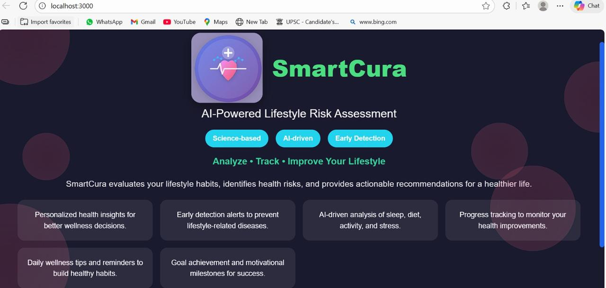
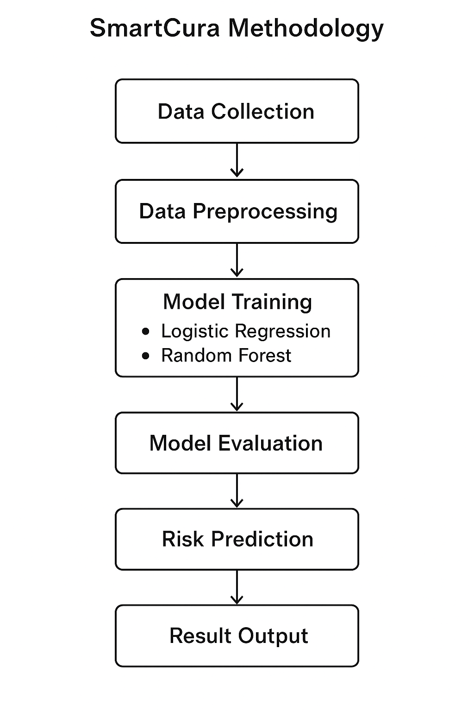
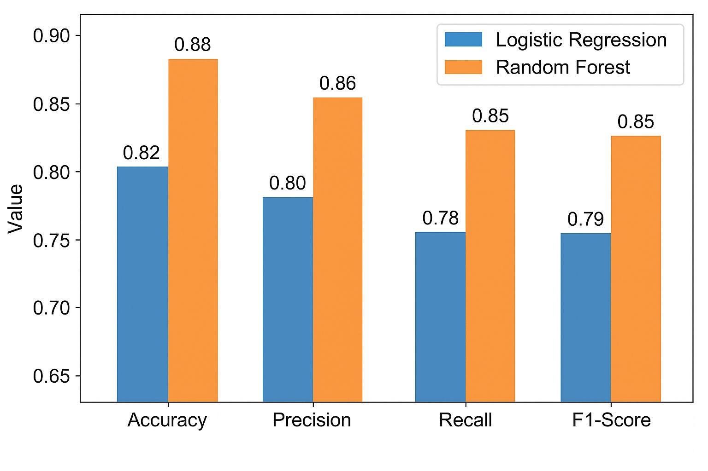
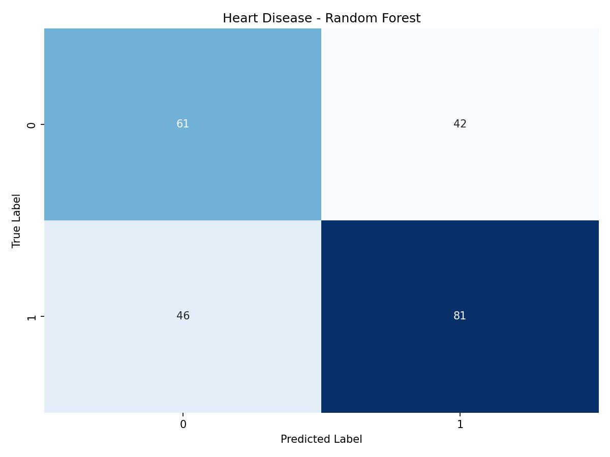
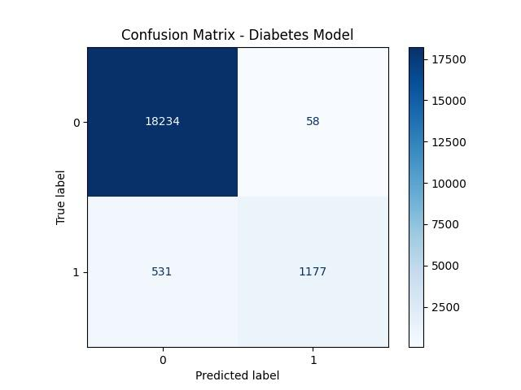
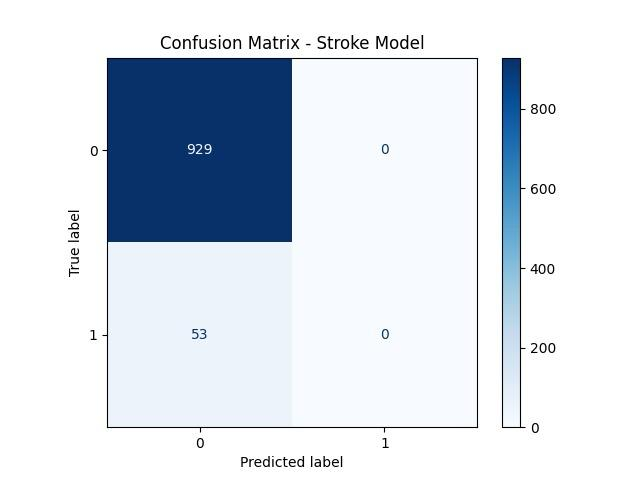

# Lifestyle Disorder Predictor

## Overview

The Lifestyle Disorder Predictor is a full-stack machine learning application that assesses the risk of lifestyle-related disorders based on user-provided health and behavioral data. The system integrates a web-based frontend with a backend API that serves trained machine learning models for real-time prediction.

---

## Features

* Predicts risks for multiple lifestyle disorders, including diabetes, heart disease, stroke, and sleep disorders
* End-to-end machine learning pipeline covering preprocessing, feature engineering, and inference
* RESTful API for model predictions
* Modular architecture with clearly separated frontend and backend
* Scalable design allowing integration of additional models and datasets

---

## System Architecture

```id="arch1"
User Input (Frontend)
        ↓
Frontend UI (Forms / Inputs)
        ↓
Backend API (Flask / FastAPI)
        ↓
Preprocessing Pipeline
        ↓
Machine Learning Model (Logistic Regression / Random Forest)
        ↓
Prediction Output (Risk Result)
        ↓
Frontend Display
```

---

## Project Structure

```id="struct1"
lifestyle-disorder-predictor/
│
├── frontend/        # User interface
├── backend/         # API and ML pipeline
│   ├── models/      # Excluded from repository (see Model Files section)
│   ├── tests/
│   └── ...
└── README.md
```

---

## Tech Stack

### Frontend

* HTML, CSS, JavaScript

### Backend

* Python
* Flask / FastAPI

### Machine Learning

* Scikit-learn
* Pandas
* NumPy

---

## Machine Learning Details

The system utilizes supervised learning techniques trained on structured health datasets.

**Models used:**

* Logistic Regression (baseline model)
* Random Forest (primary model for improved performance)

**Preprocessing steps:**

* Data cleaning and validation
* Feature encoding
* Feature scaling and normalization

---

## API Endpoints

### 1. Predict Diabetes Risk

**Endpoint:**

```
POST /predict/diabetes
```

**Request (JSON):**

```json id="api1"
{
  "age": 45,
  "bmi": 28.5,
  "glucose_level": 140,
  "physical_activity": "low"
}
```

**Response:**

```json id="api2"
{
  "prediction": "High Risk"
}
```

---

### 2. Predict Heart Disease Risk

**Endpoint:**

```
POST /predict/heart
```

---

### 3. Predict Stroke Risk

**Endpoint:**

```
POST /predict/stroke
```

---

## Setup Instructions

### 1. Clone the Repository

```id="setup1"
git clone https://github.com/chandini-narayana/lifestyle-disorder-predictor.git
cd lifestyle-disorder-predictor
```

---

### 2. Backend Setup

```id="setup2"
cd backend
pip install -r requirements.txt
python app.py
```

---

### 3. Frontend Setup

```id="setup3"
cd frontend
```

If using static files:

```id="setup4"
open index.html
```

If using a framework (e.g., React):

```id="setup5"
npm install
npm start
```

---

## Application Screenshots

### User Interface

<p align="center">
  
</p>

### System Architecture

<p align="center">
  
</p>

### Model Performance Comparison

<p align="center">
  
</p>

### Confusion Matrices

#### Heart Disease Model
<p align="center">
  
</p>

#### Diabetes Model
<p align="center">
  
</p>

#### Stroke Model
<p align="center">
  
</p>
---

## Model Files

Trained model files are not included in this repository due to size limitations.

Download the models from:
https://drive.google.com/drive/folders/1D_I-3SUiHZd9NiolLAco2tAyhCNqC4Us?usp=sharing

After downloading, place all files in:

```id="setup6"
backend/models/
```

---

## Collaboration

* Frontend Development: Bhoomika N
* Backend and Machine Learning: Chandini Narayana

---

## Future Enhancements

* Improve model accuracy and evaluation metrics
* Deploy application using cloud platforms (AWS, Render, Vercel)
* Integrate real-time health monitoring data
* Enhance user interface and user experience

---

## License

This project is intended for academic and demonstration purposes.
